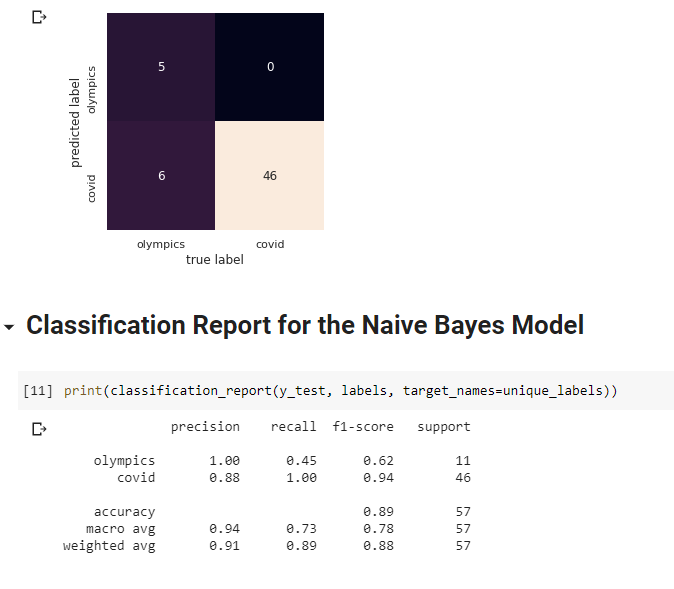

# Social Media Mining Toolkit - Examples

## Example 2

### Search for specific terms (donald trump, coronavirus, cricket) using the data acquisition tools. Preprocess the data using the data preprocessing tools. Annotate the tweets using the Annotation tool. Classify the annotated tweets using a classifier. 

1. Set up all the requirements required for Social Media Mining Toolkit (https://github.com/thepanacealab/SMMT)
2. You will need Twitter API keys for using any of the data acquisition tools. Please apply for a twitter developer account and obtain keys. Place the keys in auth.py using the format of copy_api_keys.sample.
3. You can execute the whole script by this command.

```
sh example2.sh

```

4. In this document, we explain what each command does. First, we search for 3 different terms and obtain 300 tweets per term. 

```
python search_generic.py -s "covid,olympics" -n 300

```

5. The output format we need after preprocessing the obtained json files is TweetId TAB TweetText. So first, we need to edit the fields.py. Open fields.py and keep only the following two fields.

```
fields =[ 
	'id_str', 
	'text', 
	]

```

6. The parse_json_lite.py will now only use fields from step 5 and create a tab separated file (file) with only two values per line. The output of this will be "covid.tsv ; olympics.tsv"

```
python parse_json_lite.py covid.json
python parse_json_lite.py olympics.json

```

7. The SMMT_NER_basic.py will annotate the tweets using a dictionary. This example uses a dictionary of 2 terms. The dictionary has tab separated values of Id and Term. 

```
python ../../data_annotationANDstandardization/SMMT_NER_basic.py -i olympics.tsv -o annotated_olympics.tsv -d dict.tsv 
python ../../data_annotationANDstandardization/SMMT_NER_basic.py -i covid.tsv -o annotated_covid.tsv -d dict.tsv

```
The following terms are from dict.tsv
```
Id	Term
1	covid
2	olympics
```

8. Open https://colab.research.google.com/drive/1x-ohn5mvW1vB5X9zcGxUKPRBHyFHo-T8 (Google Colab) and use the output files obtained from Annotation. The Google Colab has instructions on proceeding at each step.

9. Upload the tsv files on Step 1 and execute each step. 

10. Change the dataset and target names to the tsv files on Step 3 of the Google Colab

11. At the end, you can find the classified tweets, metrics and classification report. If the notebook runs successfully, you will be able to view metrics like the image below.


